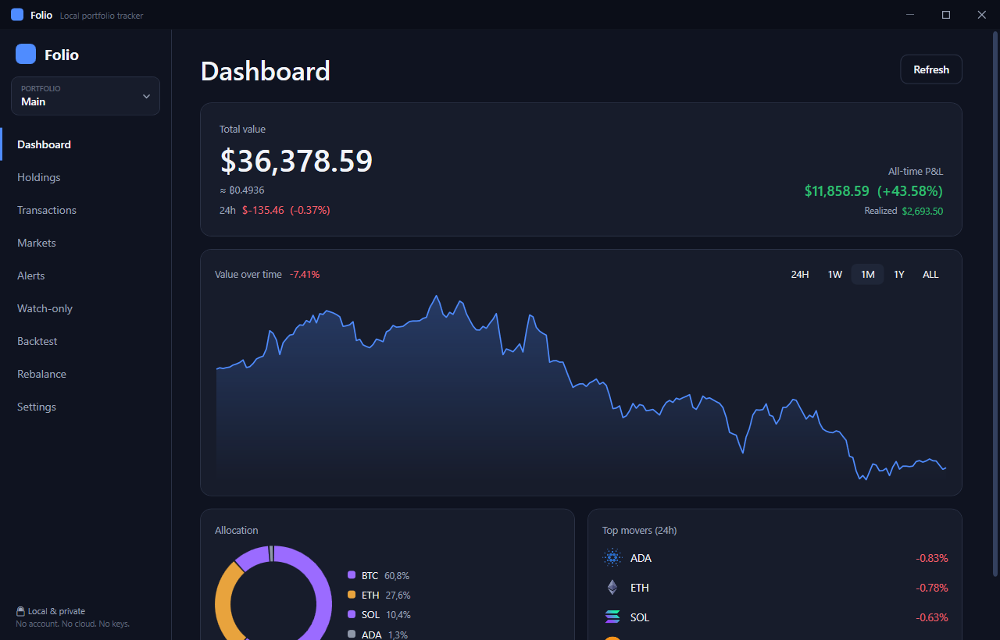
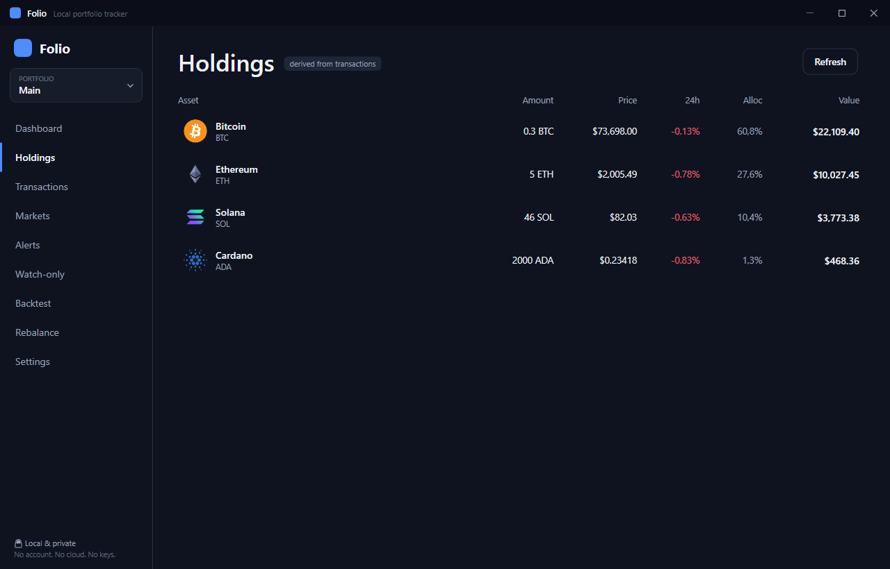
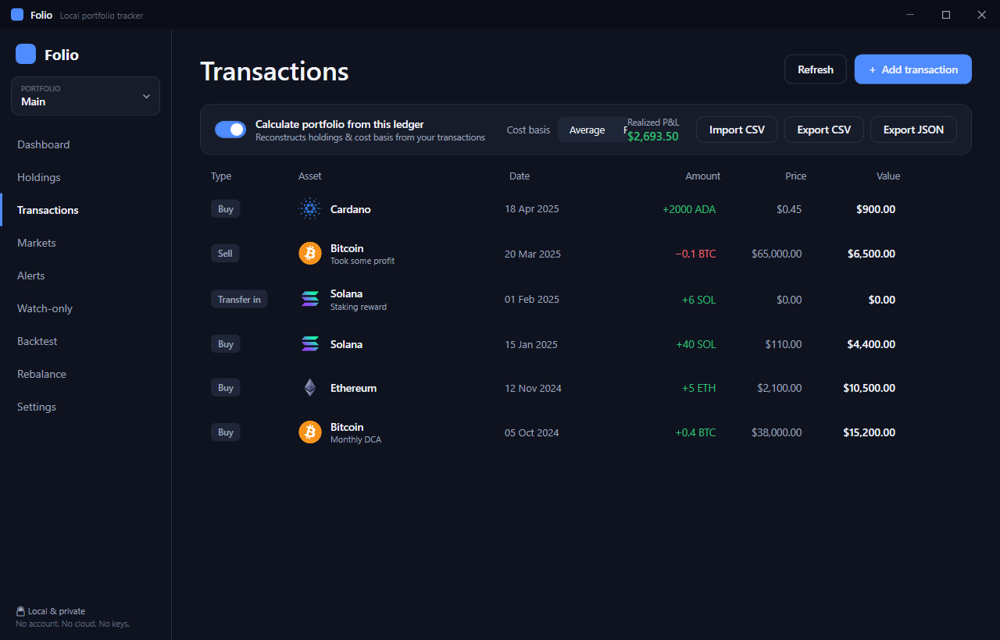
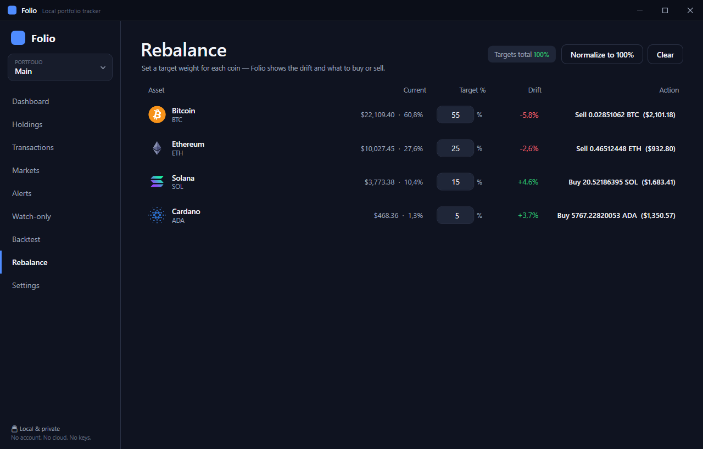
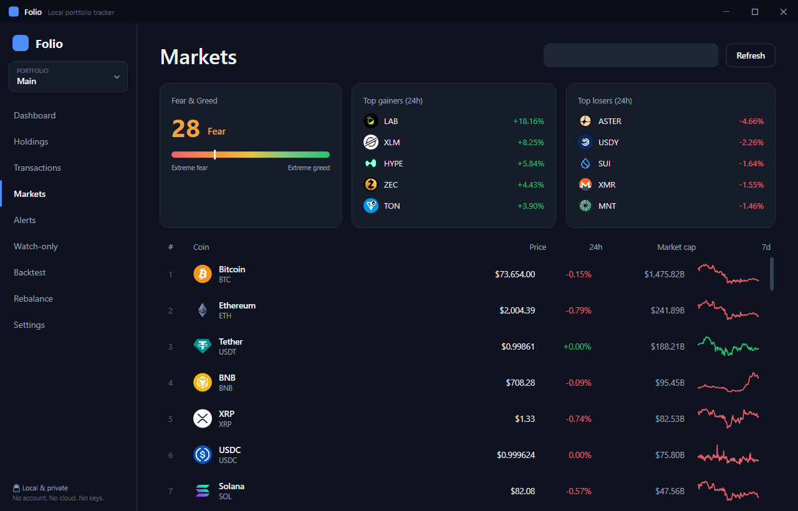
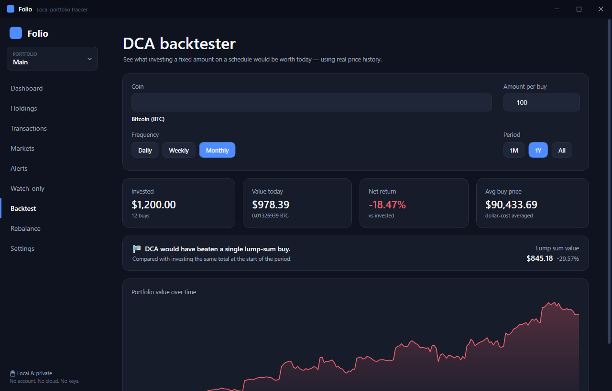
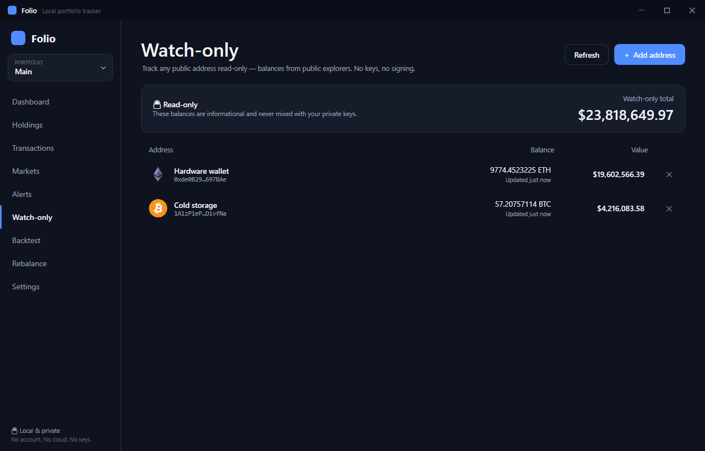
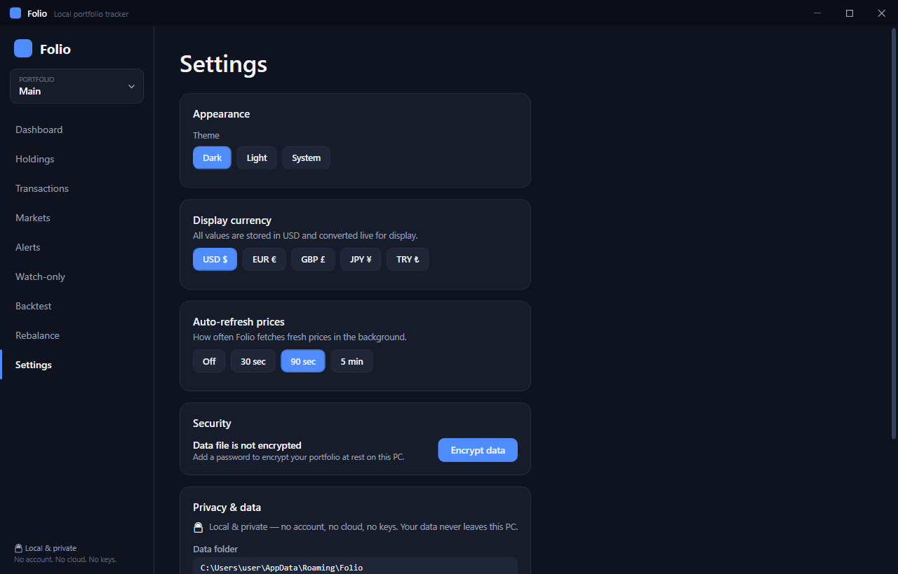

<div align="center">

# Folio

### A private, local-first cryptocurrency portfolio tracker for Windows

No account. No cloud. No wallet keys. Your data stays on your computer.




</div>

---

## Overview

Folio is a free desktop application for Windows that tracks the value of your cryptocurrency
holdings. You enter the coins you own, and Folio fetches current prices and shows your total value,
profit and loss, allocation, and performance over time — all on one screen.

Unlike web-based trackers, Folio runs entirely on your own machine. There is no account to create
and nothing is uploaded to any server. It is also strictly read-only: Folio never asks for a private
key or seed phrase and cannot access or move funds of any kind. It works only with the figures you
enter and with public market data.

In short, it is a private notebook for your portfolio that also does the arithmetic, draws the
charts, and keeps the prices up to date.

## A few terms, explained

If you are new to the subject, these are the only words you need:

| Term | Meaning |
|---|---|
| **Cryptocurrency** | Digital money, such as Bitcoin or Ethereum. |
| **Coin** | A single type of cryptocurrency. |
| **Portfolio** | The complete list of coins you own. |
| **Portfolio tracker** | A tool that shows what that list is worth at the current moment. |
| **Local / local-first** | The application runs on your computer rather than on a website, so your data remains with you. |
| **Wallet address** | A *public* identifier for a wallet — comparable to an account number that is safe to share. Folio can look one up, but it never requires the wallet's secret password. |

## ✨ Features

**Portfolio**
- Multiple portfolios with a switcher and a combined "All portfolios" view.
- Two modes per portfolio: enter amounts manually, or reconstruct holdings from a full transaction
  ledger (buy, sell, transfer, airdrop, swap, fee).
- Cost basis using the Average or FIFO method, with realized and unrealized profit and loss.
- A dashboard showing total value (also expressed in Bitcoin), 24-hour change, all-time profit and
  loss, an allocation chart, top movers, and a value-over-time chart.
- CSV import, and CSV or JSON export.

**Analysis**
- A dollar-cost-averaging backtester: see what investing a fixed amount on a schedule would be worth
  today, using real price history, compared against a single lump-sum purchase.
- A rebalancing tool: set a target weight for each coin and receive the exact buy or sell amounts
  required to reach it.
- A per-coin detail view with a live price chart, market capitalization, and your position.

**Markets and alerts**
- A markets screen with the top coins by market capitalization, the largest gainers and losers, and
  the Crypto Fear & Greed index.
- Price alerts for crossing a target above or below, evaluated on every refresh, with an in-app
  notification when triggered.

**Watch-only**
- Track any public Bitcoin or Ethereum address read-only. Balances are read from public block
  explorers; no keys are ever involved.

**Comfort and safety**
- Dark, Light, and System themes, switchable instantly.
- Five display currencies: USD, EUR, GBP, JPY, and TRY.
- A configurable automatic refresh interval.
- Optional password protection of your data file using strong encryption.
- Offline tolerance: if there is no connection, the last known prices are shown.
- Real coin logos throughout, downloaded once and cached locally.

## 📸 Screenshots

| Holdings | Transactions and cost basis |
|---|---|
|  |  |

| Rebalancing | Markets |
|---|---|
|  |  |

| DCA backtester | Watch-only addresses |
|---|---|
|  |  |

| Settings and privacy |
|---|
|  |

## 🚀 Getting started

These instructions are written so that they can be followed without prior experience. They take only
a few minutes.

### Step 1 — Install .NET 8

Folio is built on a free Microsoft platform called .NET, which is required to run it (much as a
media player is required to play a video file).

1. Open **https://dotnet.microsoft.com/download/dotnet/8.0**
2. Under **.NET 8.0**, download the **SDK** for **Windows**, **x64** edition.
3. Run the downloaded file and complete the installation.

This is a one-time step. If your computer already has .NET 8, you may skip it.

### Step 2 — Obtain the source

There are two options. The first requires no additional tools.

**Download a ZIP archive:**
1. At the top of this page, select the green **Code** button.
2. Choose **Download ZIP**.
3. Locate the downloaded archive (usually in your Downloads folder), right-click it, choose
   **Extract All**, and select a convenient location.

**Or clone with git:**
```bash
git clone https://github.com/YOUR-USERNAME/folio.git
```

### Step 3 — Open a command prompt in the project folder

1. Open the extracted Folio folder (the one that contains the `src` folder and this file).
2. Click the address bar at the top of the window.
3. Type **`cmd`** and press **Enter**. A command prompt opens, already pointed at the folder.

### Step 4 — Run the application

In the command prompt, enter:

```bash
dotnet run --project src/Folio
```

The first launch takes a moment to prepare. The Folio window then opens. To start Folio again later,
repeat Steps 3 and 4.

### Running the tests (optional)

To confirm that the calculations are correct, run:

```bash
dotnet test
```

The result should report **69** passing tests.

## 🔒 Privacy and data

Privacy is the central design goal of Folio, and it is straightforward to verify.

**Where your information is stored.** Everything is kept in a single folder on your computer:

```
C:\Users\<you>\AppData\Roaming\Folio\
```

This folder contains plain files for your portfolios, settings, alerts, and watched addresses, along
with caches for prices and logos. You can back it up, move it, or delete it. Nothing is written
anywhere else.

**When the network is used.** Folio makes outbound requests only to read public market data — never
to send your holdings. The complete list of hosts (also shown in the application, under Settings) is:

| Host | Purpose |
|---|---|
| `api.coingecko.com` | Prices, markets, history, and exchange rates |
| `coin-images.coingecko.com` | Coin logos (cached locally after the first download) |
| `api.alternative.me` | The Crypto Fear & Greed index |
| `mempool.space` | Watch-only Bitcoin balances |
| `eth.blockscout.com` | Watch-only Ethereum balances |

Only public information is ever sent, such as a coin identifier or a public wallet address. Your
amounts, transactions, and totals are never transmitted. If watch-only addresses are not used, the
explorer hosts are never contacted; if automatic refresh is disabled, no requests are made at all.

**Additional protections.**
- The application continues to function offline, showing the last known prices.
- It never requests a private key or seed phrase, and has no capability to do so.
- The data file can be encrypted with a password (AES-256-GCM, key derived with PBKDF2). When
  encryption is enabled, Folio asks for the password at startup.

For the complete threat model, see **[docs/PRIVACY.md](docs/PRIVACY.md)**.

## ❓ Frequently asked questions

**Is it free?** Yes, entirely. There are no advertisements, payments, or paid tiers.

**Can it access or move my cryptocurrency?** No. Folio has no connection to any wallet. It works
only with the figures you enter and with public market data.

**Do I need to create an account?** No. There is no sign-in of any kind.

**Does it require an internet connection?** Only to refresh prices. It otherwise functions offline
using the most recent prices it retrieved.

**Where is my data, and can I remove it?** It is in the `Folio` folder shown above. Deleting that
folder returns the application to a clean state.

**Which systems are supported?** Windows 10 and Windows 11.

**What does the password protect?** It encrypts this application's data file only; it is unrelated to
any real wallet. If encryption is enabled, the password cannot be recovered, so it must not be lost.

## For developers

<details>
<summary>Technical details</summary>

Folio is a WPF (.NET 8) desktop application written in C#, following the MVVM pattern. The design
maintains a strict separation between a pure, unit-tested calculation engine (no UI, no network, no
file access) and the services that fetch data and persist state.

```
src/Folio/
  Engine/        Pure calculations: cost basis, portfolio totals, value series, DCA, rebalancing
  Models/        Domain records and storage DTOs
  Services/      Market data (CoinGecko, explorers), persistence, session, theme, alerts, icons
  ViewModels/    One per screen (CommunityToolkit.Mvvm)
  Views/         XAML, custom-drawn charts, runtime theming
tests/Folio.Tests/   xUnit and FluentAssertions (network-free via a fake HTTP handler)
docs/                Architecture, design, privacy, and screenshots
```

**Technology:** .NET 8, WPF, C# 12, CommunityToolkit.Mvvm,
Microsoft.Extensions.DependencyInjection, xUnit, FluentAssertions, custom-drawn charts (no charting
dependency), System.Text.Json, AesGcm with PBKDF2.

**Notes:**
- Prices, markets, history, exchange rates, and coin logos are cached to disk, making the
  application offline-tolerant.
- The data file can be AES-256-GCM encrypted, with a startup unlock.
- File writes are atomic (temporary file, rename, and backup) with backup recovery and schema
  migration.
- The test suite contains 69 tests covering the engine, persistence, and services.

```bash
dotnet build      # build the solution
dotnet test       # run the test suite
dotnet run --project src/Folio
```

Further detail is available in **[docs/ARCHITECTURE.md](docs/ARCHITECTURE.md)**,
**[docs/DESIGN.md](docs/DESIGN.md)**, **[docs/PRIVACY.md](docs/PRIVACY.md)**, and
**[CONTRIBUTING.md](CONTRIBUTING.md)**.

</details>

## Disclaimer

Folio is a tool for tracking and education. It is **not financial advice**. Market data is supplied
by third-party services and may be delayed or inaccurate. Always conduct your own research before
making financial decisions.

## License

Folio is free and open source under the [MIT License](LICENSE).
